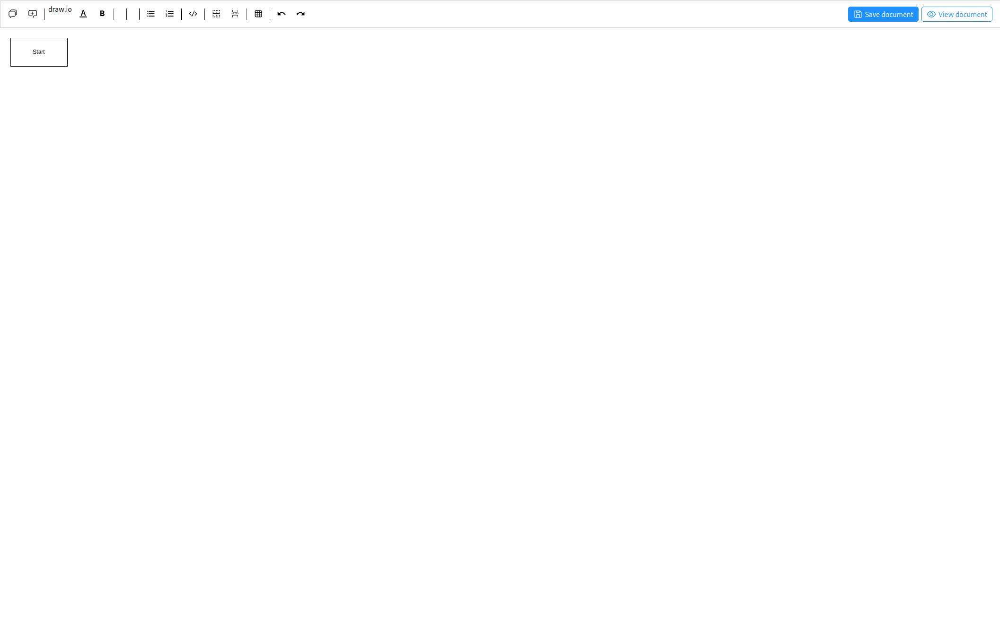
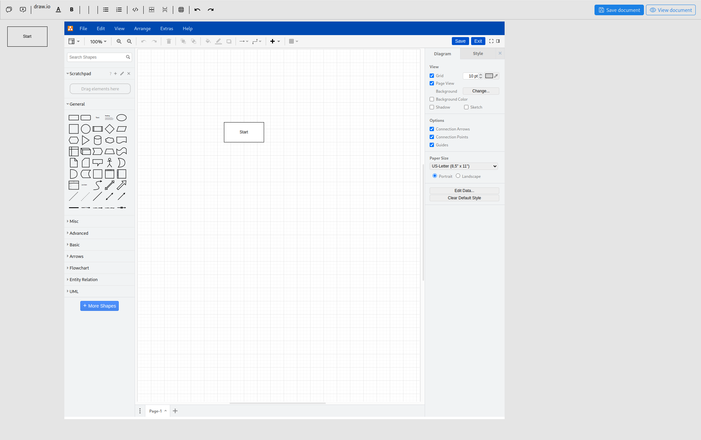
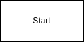

# DrawIoExtension

[Live example](https://radans.github.io/tiptap-drawio-extension/)

Extension of tiptap image extension. Used to for drawio plugin.





## Usage

### Installation

```bash
npm install @rcode-link/tiptap-drawio
```

### Include in editor

```js
import drawIoExtension from '@rcode-link/tiptap-drawio';

const editor = Editor({
    extensions: [
        drawIoExtension.configure({
            openDialog: 'dblclick'
        })
    ]
})
```

### Configuration

since its extension on extension image you can use whatever things you would like with this extension.
base configuration:

```json
{
  "drawIoLink": "https://embed.diagrams.net/?embed=1&ui=atlas&spin=1&modified=unsavedChanges&proto=json",
  "baseImage": "base64/png",
  "openDialog": "click"
}
```

#### drawIoLink

in case that you have self hosted or want to use some different instance of drawio this is
place where it can be chagned.

### baseImage

when image is inserted is hows base image with start square.



if you want to use some different image just pass base64 png to this property

### openDialog
defines when dialog will be opened default click.
options: 
 - click
 - dblclick

## Inserting drawio image
```js
editor.commands.insertDrawIo()
```

# License
MIT License

Permission is hereby granted, free of charge, to any person obtaining a copy of this software and associated documentation files (the "Software"), to deal in the Software without restriction, including without limitation the rights to use, copy, modify, merge, publish, distribute, sublicense, and/or sell copies of the Software, and to permit persons to whom the Software is furnished to do so, subject to the following conditions:

The above copyright notice and this permission notice shall be included in all copies or substantial portions of the Software.

THE SOFTWARE IS PROVIDED "AS IS", WITHOUT WARRANTY OF ANY KIND, EXPRESS OR IMPLIED, INCLUDING BUT NOT LIMITED TO THE WARRANTIES OF MERCHANTABILITY, FITNESS FOR A PARTICULAR PURPOSE AND NONINFRINGEMENT. IN NO EVENT SHALL THE AUTHORS OR COPYRIGHT HOLDERS BE LIABLE FOR ANY CLAIM, DAMAGES OR OTHER LIABILITY, WHETHER IN AN ACTION OF CONTRACT, TORT OR OTHERWISE, ARISING FROM, OUT OF OR IN CONNECTION WITH THE SOFTWARE OR THE USE OR OTHER DEALINGS IN THE SOFTWARE.

