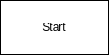

# DrawIoExtension

Extension of tiptap image extension. Used to for drawio plugin.

## Usage

### Installation

```bash
npm install @rcode-link/tiptap-drawio
```

### Include in editor

```js
import drawIoExtension from '@rcode-link/tiptap-drawio';

const editor = Editor({
    extensions: [
        StarterKit,
        customComment
    ]
})
```

### Configuration

since its extension on extension image you can use whatever things you would like with this extension.
base configuration:

```json
{
  "drawIoLink": "https://embed.diagrams.net/?embed=1&ui=atlas&spin=1&modified=unsavedChanges&proto=json",
  "baseImage": "base64/png",
  "openDialog": "click"
}
```

#### drawIoLink

in case that you have self hosted or want to use some different instance of drawio this is
place where it can be chagned.

### baseImage

when image is inserted is hows base image with start square.



if you want to use some different image just pass base64 png to this property

### openDialog
defines when dialog will be opened default click.
options: 
 - click
 - dblclick

## Inserting drawio image
```js
editor.commands.insertDrawIo()
```